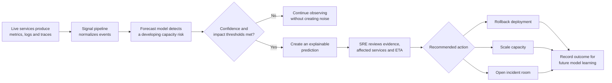
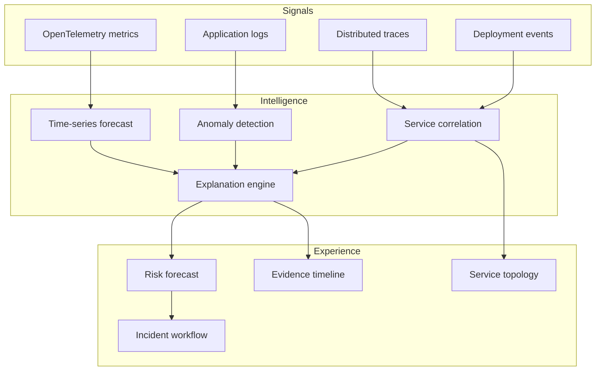
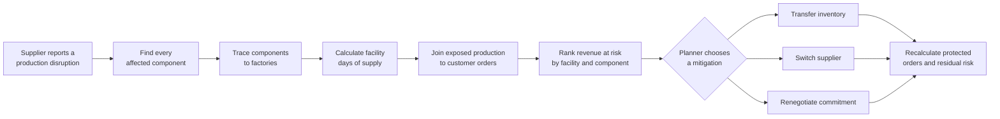
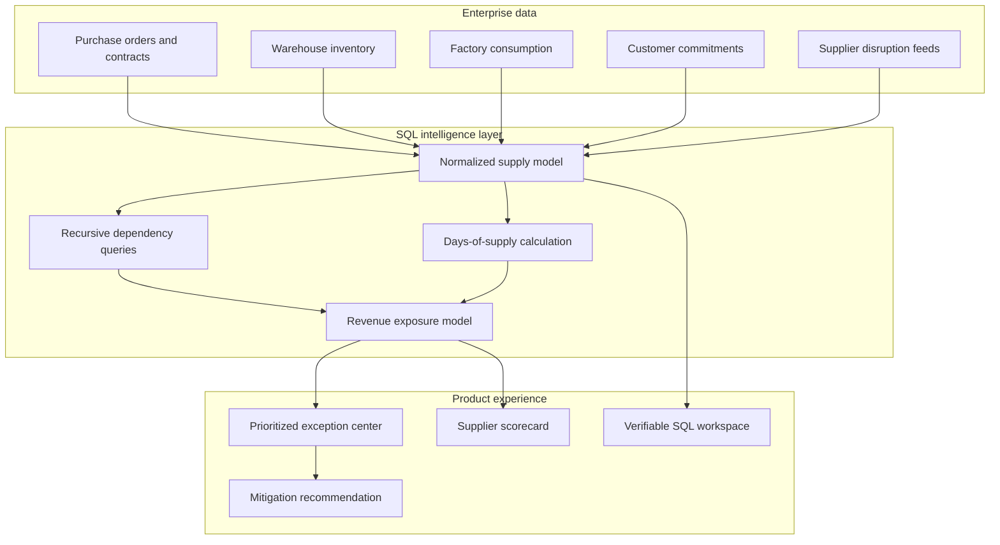

<div align="center">

# Product Management Portfolio

### Enterprise strategy · AI reliability · Supply chain · SQL

Two end-to-end product case studies showing how ambiguous enterprise problems become clear, measurable product decisions.

[View the live portfolio](https://forge-pm-portfolio.anne437271.chatgpt.site) · [SentinelOps](#01--sentinelops) · [SupplyShield](#02--supplyshield)

</div>

---

## Why this portfolio exists

Most product portfolios stop at polished screens. This repository documents the reasoning underneath them: the user problem, decision flow, metrics, guardrails, data model, technical tradeoffs, and validation plan.

| Case study | Business problem | Primary users | North-star outcome |
|---|---|---|---|
| **SentinelOps** | Reliability teams discover capacity failures too late | SREs, incident commanders, engineering leaders | Mean time to detection |
| **SupplyShield** | Fragmented supply data hides financial exposure | Supply planners, procurement, operations leaders | Revenue exposure identified |

> **Transparency:** The companies, records, and outcome figures are simulated. The product strategy, UX, data model, SQL, and technical implementation are original portfolio work.

---

## 01 — SentinelOps

**Predict the incident before customers feel it.**

SentinelOps converts logs, infrastructure metrics, deployment events, and service dependencies into an explainable early warning. The MVP deliberately focuses on capacity failures instead of attempting to detect every possible anomaly.

### Real-world user walkthrough



### Product decision architecture



### Key product decisions

1. **Depth before breadth:** validate one high-value failure class—capacity exhaustion—before expanding detection coverage.
2. **Evidence beside prediction:** show the deployment change, abnormal signal, service dependency, confidence, and forecast horizon together.
3. **Action over alerting:** measure whether teams make a faster, better incident decision—not how many warnings the system generates.

| Success type | Measure |
|---|---|
| North star | Mean time to detection |
| Supporting | Prediction lead time; acknowledged predictions; prevented impact minutes |
| Guardrail | False-positive rate below 8%; no automated remediation without human approval |

---

## 02 — SupplyShield

**Connect a supplier delay to the revenue it puts at risk.**

SupplyShield joins supplier, component, inventory, factory, and customer-order data so operations teams can prioritize disruptions by business impact and identify the safest mitigation.

### Real-world user walkthrough



### Data and decision architecture



### Key product decisions

1. **Financial impact first:** revenue exposure is more decision-useful than a generic disruption severity score.
2. **Analyst-verifiable AI:** every natural-language result must expose the SQL and underlying records.
3. **Actionability over volume:** rank exceptions by mitigation, affected commitments, time window, and financial impact.

### SQL capabilities demonstrated

- Window functions for supplier performance trends
- Recursive dependency analysis for multi-tier components
- Stockout forecasting using inventory and consumption
- Revenue exposure joins across facilities and customer orders
- Indexing and partitioning for operational-scale datasets
- Data-quality constraints and analyst-verifiable queries

Explore [`sql/schema.sql`](sql/schema.sql) and [`sql/analysis.sql`](sql/analysis.sql).

---

## Product development process

```mermaid
flowchart LR
    A[Frame the business decision] --> B[Identify users and stakeholders]
    B --> C[Map the current workflow]
    C --> D[Define north-star and guardrails]
    D --> E[Prioritize the smallest useful MVP]
    E --> F[Prototype the critical decision path]
    F --> G[Model the supporting data]
    G --> H[Plan interviews and usability tests]
    H --> I[Measure, learn and iterate]
```



## Repository guide

```text
app/                     Interactive portfolio and product UX
docs/                    Interview narrative and product requirements
sql/schema.sql           Enterprise supply-chain data model
sql/analysis.sql         Decision-support SQL queries
public/                  Portfolio sharing assets
README.md                Product story and system walkthroughs
```

## Run the experience

```bash
pnpm install
pnpm dev
```

Then open `http://localhost:3000`.

## What I would validate next

- Interview five users in every primary role.
- Establish a baseline for each north-star metric.
- Test whether users can explain and act on a prediction without assistance.
- Compare the MVP against the current manual workflow.
- Define explicit go/no-go thresholds before increasing engineering investment.

---

<div align="center">

Built as a product-management portfolio for enterprise, platform, AI, and data-product internships.

</div>

